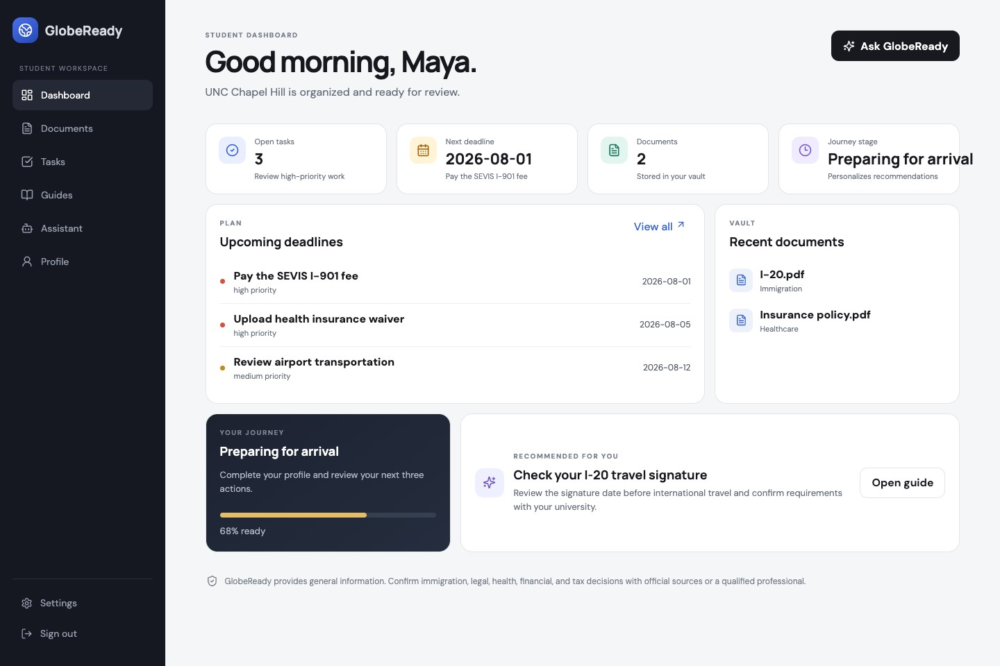
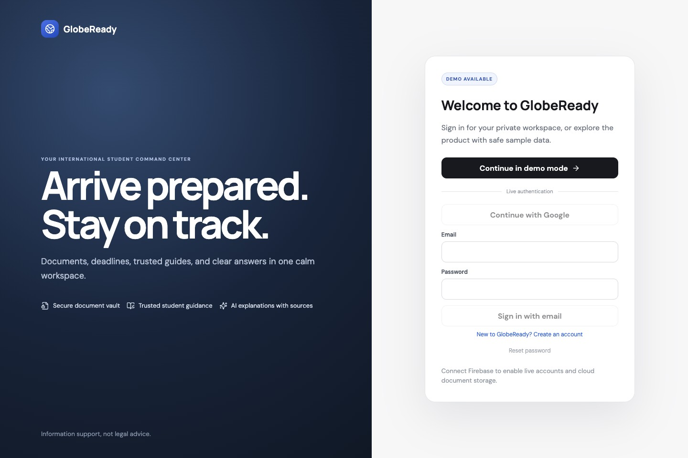
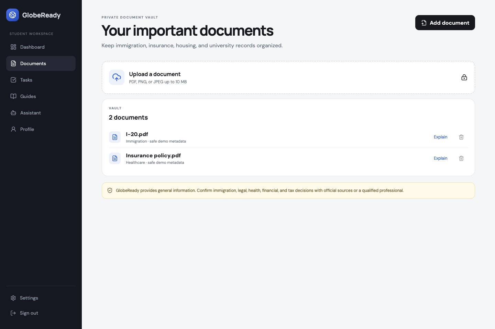
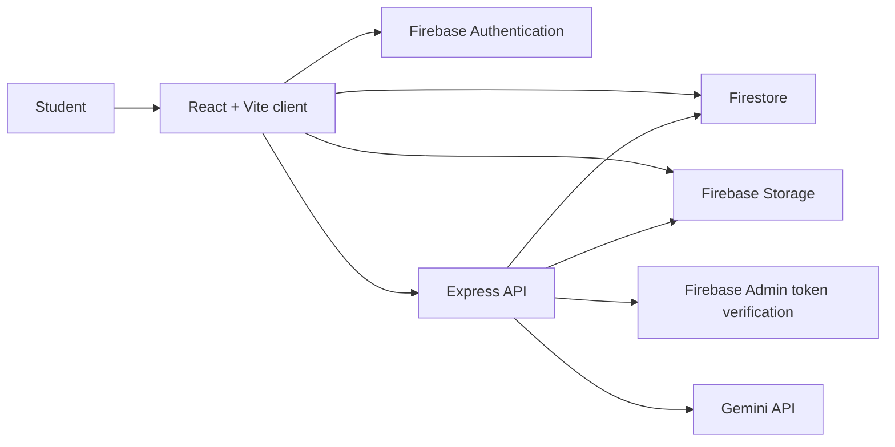

# GlobeReady

[](https://github.com/shlokbhutani13/globeready/actions/workflows/ci.yml)
[](LICENSE)
[](client/package.json)
[](firebase.json)

GlobeReady is a full-stack productivity workspace for international students. It brings documents, deadlines, official resources, profile-based guidance, and AI explanations into one focused application.

The repository demonstrates production-minded authentication, user-scoped data, secure file handling, AI integration, responsive product design, automated tests, and documented deployment.

> **Project status:** deployment-ready code with a credential-free demo mode. No public production deployment is attached to this repository.



## Product tour

| Authentication | Document vault |
| --- | --- |
|  |  |

Users can:

- Sign up with email and password or use Google through Firebase Authentication.
- Store profile, task, document, and saved-resource data under their Firebase UID.
- Upload PDF, PNG, and JPEG documents up to 10 MB.
- Request plain-language Gemini explanations for an authorized document.
- Track deadlines, complete tasks, and save official student resources.
- Use the full responsive interface with safe sample data when credentials are unavailable.

## Engineering highlights

| Area | Implementation |
| --- | --- |
| Identity | Firebase Auth on the client; Firebase Admin ID-token verification on protected API routes |
| Data isolation | Firestore records and Storage objects live below `users/{uid}` with matching security rules |
| Document security | Type and size validation, sanitized filenames, user-folder checks before server-side analysis |
| AI safety | Curated official sources, structured responses, disclaimers, prompt-injection guidance, per-user throttling |
| Resilience | Deterministic assistant fallback when Gemini is unavailable; failed metadata writes clean up uploaded files |
| Delivery | Vite 8 production build, Node.js 22 API, API Dockerfile, Vercel SPA routing, GitHub Actions |
| Quality | 23 automated tests, clean production builds, zero npm audit findings |

## Architecture



The browser handles authenticated product data through Firebase. The Express service owns token verification, bounded AI requests, trusted-source selection, and document analysis. Demo mode keeps sample data in memory and never uploads identity documents.

## Technology

- React 18, React Router, Vite 8
- Firebase Authentication, Firestore, Storage, Admin SDK
- Express 5 and Node.js 22
- Google Gen AI SDK
- Vitest, Testing Library, and Supertest
- GitHub Actions and Docker

## Run locally

Requirements: Node.js 22.

```bash
git clone https://github.com/shlokbhutani13/globeready.git
cd globeready
cp server/.env.example server/.env
cp client/.env.example client/.env.local
```

Start the API:

```bash
cd server
npm install
npm run dev
```

Start the client in a second terminal:

```bash
cd client
npm install
npm run dev
```

Open `http://localhost:5173` and choose **Continue in demo mode**. Firebase and Gemini credentials are optional for the demo.

## Verification

```bash
cd server
npm ci
npm audit
npm test
npm run lint

cd ../client
npm ci
npm audit
npm test
npm run build
```

GitHub Actions runs the server and client checks on every push and pull request.

## Security and privacy

- Protected API routes derive identity from verified Firebase tokens.
- Firestore and Storage rules enforce `request.auth.uid == uid`.
- The API rejects document paths outside the authenticated user's Storage folder.
- AI endpoints apply a configurable per-user request limit.
- Local environment files and production credentials stay outside Git.
- GlobeReady provides general information, not legal, immigration, tax, health, or financial advice.

Read [SECURITY.md](SECURITY.md) and [docs/PRIVACY.md](docs/PRIVACY.md) before configuring real identity documents.

## Deployment

The client and API deploy separately. [DEPLOYMENT.md](DEPLOYMENT.md) covers Firebase setup, environment variables, API packaging, Vercel routing, and the production release checklist.

Live Firebase and Gemini flows require a credentialed end-to-end test against the chosen production project. Use synthetic documents during that validation.

## Documentation

- [Architecture](docs/ARCHITECTURE.md)
- [Deployment guide](DEPLOYMENT.md)
- [Privacy model](docs/PRIVACY.md)
- [Roadmap](docs/ROADMAP.md)
- [Migration from `int_students`](docs/MIGRATION.md)
- [Contributing](CONTRIBUTING.md)

## License

MIT
