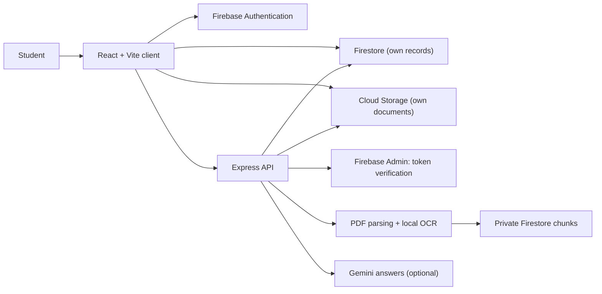

# GlobeReady

[](https://github.com/shlokbhutani13/globeready/actions/workflows/ci.yml)
[](LICENSE)
[](.nvmrc)
[](firebase.json)

GlobeReady helps international students in the United States follow verified official updates, plan deadlines, ask grounded questions about their own documents, and control their data.

GlobeReady provides general information, not legal, immigration, tax, health, or financial advice. Confirm decisions with your Designated School Official (DSO), your university, or the relevant government agency.

> **Release status:** not yet released. See [DEPLOYMENT.md](DEPLOYMENT.md) for the launch scope, limitations, and the steps required before release.

## What the launch includes

- **Updates:** verified federal and university updates with official links, legal-state labels, and freshness. Save and filter updates. Sources that are delayed are shown as delayed.
- **My Plan:** tasks with due dates and priorities, a month calendar, and in-app reminders with a notification inbox.
- **Documents and Assistant:** text-based PDFs with page-referenced text, and PNG/JPEG photos of printed text read with local OCR. Scanned or image-only PDFs, handwriting, and malformed or blank files are not read; each gets a clear message and keeps the upload. Document questions return citations, say when the evidence is missing, and route high-risk questions to a DSO or professional. Conversations are kept per student.
- **Account:** profile, university, time zone, email-preference settings (email is not sent yet), a JSON data export, and account deletion.

Email delivery and browser push are not part of the launch.

## Architecture



The client reads a student's own records through Firebase rules. The API verifies identity on every protected request, derives the student from the verified token, and performs document reading, answer generation, publication, administration, and account deletion. [docs/ARCHITECTURE.md](docs/ARCHITECTURE.md) describes each component.

## Run locally

Requirements: Node.js 22 (`.nvmrc`).

```bash
git clone https://github.com/shlokbhutani13/globeready.git
cd globeready
cp server/.env.example server/.env
cp client/.env.example client/.env.local
```

Start the API in one terminal and the client in another:

```bash
cd server && npm ci && npm run dev
cd client && npm ci && npm run dev
```

For explicit local demo mode, run `npm run demo` in both `server/` and `client/`. Demo mode uses sample data in memory, accepts an `x-demo-user` header as the identity, and needs no Firebase or Gemini credentials. It is development-only; without both explicit demo commands the client sends no demo identity and the API never falls back to one.

Open `http://localhost:5173` and choose **Continue in demo mode**. Live accounts, documents, and deletion require Firebase configuration.

## Verification

```bash
cd server && npm ci && npm test && npm run lint && npm run test:rules
cd client && npm ci && npm test && npm run build
```

`npm run test:rules` starts the Firestore, Auth, and Storage emulators (requires Java 21). It covers the Firestore rules, recursive account deletion, and the account deletion path with real Auth tokens and Storage objects. GitHub Actions runs these checks on every push and pull request.

## Security and privacy

- Protected API routes derive identity from verified Firebase ID tokens. Request bodies cannot select another student.
- Firestore and Storage rules restrict each student's records to their own UID. Retrieval chunks are server-only.
- Uploaded files are checked by type, size, and private path, both at upload and again before reading.
- A university domain is registered only as pending until an administrator verifies it.
- Account deletion requires a recent sign-in and removes the student's stored data.
- Generated answers are limited to retrieved evidence, and definitive legal or status conclusions are replaced with a referral.

Read [SECURITY.md](SECURITY.md) and [docs/PRIVACY.md](docs/PRIVACY.md) before configuring real identity documents.

## Documentation

- [Deployment and release checklist](DEPLOYMENT.md)
- [Architecture](docs/ARCHITECTURE.md)
- [Privacy model](docs/PRIVACY.md)
- [Roadmap](docs/ROADMAP.md)
- [Contributing](CONTRIBUTING.md)

## License

MIT
