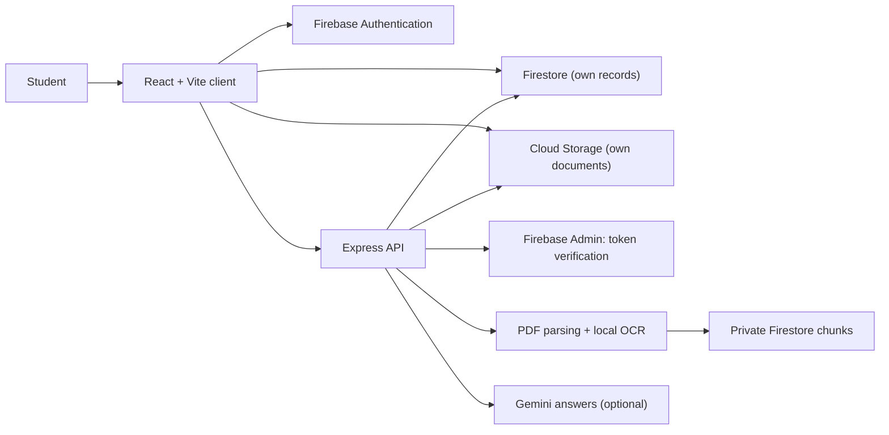

# GlobeReady

[](https://github.com/shlokbhutani13/globeready/actions/workflows/ci.yml)
[](LICENSE)
[](.nvmrc)
[](firebase.json)

GlobeReady helps international students in the United States follow verified official updates, plan deadlines, ask grounded questions about their own documents, and control their data.

GlobeReady provides general information, not legal, immigration, tax, health, or financial advice. Confirm decisions with your Designated School Official (DSO), your university, or the relevant government agency.

> **Release status:** not released. Nothing has been deployed. The current production-readiness position and its open items are in [docs/RELEASE_READINESS.md](docs/RELEASE_READINESS.md).

## What the launch includes

- **Updates:** verified federal and university updates with official links, legal-state labels, and freshness. Save and filter updates. Sources that are delayed are shown as delayed.
- **My Plan:** tasks with due dates and priorities, a month calendar, and in-app reminders with a notification inbox.
- **Documents and Assistant:** text-based PDFs with page-referenced text, and PNG/JPEG photos of printed text read with local OCR. Scanned or image-only PDFs, handwriting, and malformed or blank files are not read; each gets a clear message and keeps the upload. Document questions return citations, say when the evidence is missing, and route high-risk questions to a DSO or professional. Conversations are kept per student.
- **Account:** profile, university, time zone, email-preference settings (email is not sent yet), a JSON data export, and account deletion.

Email delivery and browser push are not part of the launch.

## Architecture



The client reads a student's own records through Firebase rules. The API verifies identity on every protected request, derives the student from the verified token, and performs document reading, answer generation, publication, administration, and account deletion. [docs/ARCHITECTURE.md](docs/ARCHITECTURE.md) describes each component.

## Run locally

Requirements: Node.js 22 (`.nvmrc`). Local-user mode also needs Java 21 for the Firebase emulators.

GlobeReady has three modes. They are mutually exclusive and documented in [docs/MODES.md](docs/MODES.md):

| Mode | Start | What it is |
| --- | --- | --- |
| Demo | `npm run demo` in `server/` and `client/` | Sample data in memory; no account, no uploads. Development only. |
| Local-user | `npm run local-user` in `client/` | Real accounts, rules, uploads, and document reading, on the Firebase emulators on this computer. Persists across restarts. Development only. |
| Production | Not started locally | Real Firebase only. Refuses to start without its full configuration. See [docs/CONFIGURATION.md](docs/CONFIGURATION.md). |

Local-user mode, from a fresh clone:

```bash
cd server && npm ci && cd ../client && npm ci
npm run local-user        # starts the emulators, seeds two synthetic accounts, starts the API and the app
```

Open `http://127.0.0.1:5173`. The seeded accounts and their passwords are in `.local/credentials.json` (ignored by git).
The Google button is a mock identity from the emulator; it is not your Google account. Stop with `npm run local-user:stop`,
and delete all local data with `npm run local-user:reset`. Details are in [docs/OPERATIONS.md](docs/OPERATIONS.md).

Demo mode:

```bash
cd server && npm run demo        # terminal 1
cd client && npm run demo        # terminal 2 (uses client/.env.demo, which contains no credentials)
```

Demo mode accepts the `x-demo-user` header as the identity. Production refuses it.

## Verification

```bash
cd server && npm ci && npm test && npm run lint && npm run test:rules
cd client && npm ci && npm test && npm run build
```

`npm run test:rules` starts the Firestore, Auth, and Storage emulators (requires Java 21). It covers the security rules,
recursive account deletion, the account path with real Auth tokens and Storage objects, and the source-snapshot commit
under a lease. The production image is checked with `scripts/release/docker-fail-closed.sh <image>`. GitHub Actions runs
all of these on every push and pull request. Nothing is deployed by CI.

## Security and privacy

- Protected API routes derive identity from verified Firebase ID tokens, with revocation checks. Request bodies cannot select another student.
- Firestore and Storage rules restrict each student's records to their own UID. Retrieval chunks are server-only.
- Uploaded files are checked by declared type, real file signature, size, and exact private path, both at upload and again before reading.
- A university domain is registered only as pending until an administrator verifies it.
- Account deletion requires a recent sign-in and removes the student's stored data, in an order that can be retried.
- Generated answers are limited to retrieved evidence, and definitive legal or status conclusions are replaced with a referral.
- Production refuses to start without its full configuration, and never falls back to demo or local-user behavior.

Read [SECURITY.md](SECURITY.md) and [docs/PRIVACY.md](docs/PRIVACY.md) before configuring real identity documents.

## Documentation

- [Modes: demo, local-user, and production](docs/MODES.md)
- [Configuration contract](docs/CONFIGURATION.md)
- [Operations: startup, shutdown, health, logging, local state](docs/OPERATIONS.md)
- [Deployment procedure](DEPLOYMENT.md)
- [Rollback and recovery](docs/ROLLBACK.md)
- [Smoke tests](docs/SMOKE_TESTS.md)
- [Release readiness](docs/RELEASE_READINESS.md)
- [Architecture](docs/ARCHITECTURE.md)
- [Privacy model](docs/PRIVACY.md)
- [Security policy](SECURITY.md)
- [Roadmap](docs/ROADMAP.md)
- [Contributing](CONTRIBUTING.md)

## License

MIT
